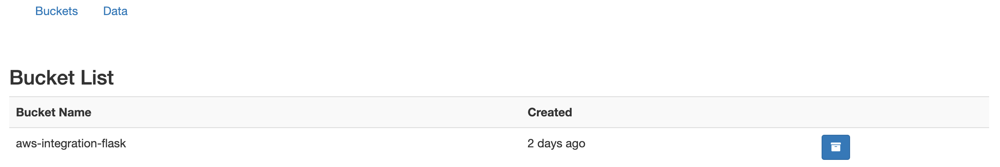
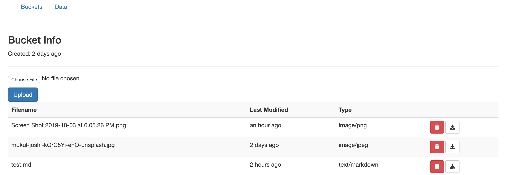

# Amazon AWS S3 Management Console

Amazon Simple Storage Service provides object service through web service interface. Here, we make an interface to interact with S3 webservice. This is especially helpful in making web apps as AWS S3 can be employed to store any types of objects.

AWS is great choice for many applications as it guarantees 99.9% monthly uptime. 

## Buckets
The basic storage units of Amazon S3 are objects which are organized into buckets. An AWS customer can use an Amazon S3 API to upload objects to a particular bucket. 

## Objects
Every bucket stores files called as "objects". Amazon S3 is an object storage service, which differs from block and file cloud storage. Unlike file and block cloud storage, a developer can access an object via a REST API.

## Usage
For the app to run successfully, the user needs to save the bucket name, key and password as an environment variable. This can be obtained after creating an user in AWS S3 web interface. 

```
export S3_BUCKET="xxxxx"
export S3_KEY="????????????????????"
export S3_SECRET="?????????????????/??????????????????????"
```

## NOTE
The AWS console provides tools for managing and uploading files but it is not capable of managing large buckets or editing files.

## App GUI
<p align="center">
  
</p>

<p align="center">
  
</p>